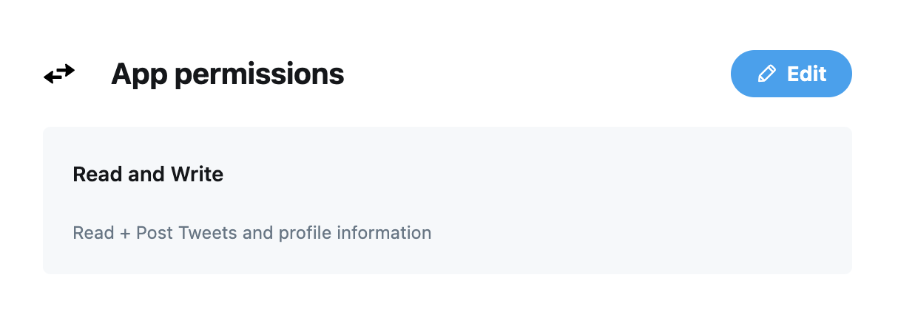

# Golang twitter http client

There is a package named [go-twitter](https://github.com/dghubble/go-twitter/) that's basically an abstraction on top of a [twitter API](https://developer.twitter.com/en/docs/twitter-api/v1) http client. The main purpose here is just show a proof of concept (POC) based on `twitter API` encouraged by a
[stackoverflow](https://pt.stackoverflow.com/questions/496796/como-realizar-um-post-com-um-m%c3%a9todo-de-aut%c3%aantica%c3%a7%c3%a3o-de-terceiros) question.

## Pre requisites

Donwload the last version of [golang](https://golang.org/).

## Running the project

First you need to submit a form to dev twitter page and register youself on [this link](https://dev.twitter.com/apps/new). After that, at the `Developer Portal`, go to `Projects & Apps` > `Overview` and then click on `+ Create App` button. Inside your App, go to `Keys and tokens` tab and generate your `Consumer Keys` and `Access Token and Secret` (store all of them in a safe place). To this example is required to the app writes on twitter because we're sending a tweet, to do that, set the `App permissions` at the `Settings` tab:



Then, replace the fields in the [.env](src/.env) file by the `Consumer Key`, `Consumer Secret`, `Access Token` and `Access Secret` that you stored before.

To run the app, go to the [src](src/) folder and type:

``` bash
go run main.go
```
